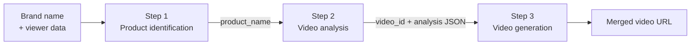

Splyce transforms a brand name and viewer profile into a personalized video ad using a sequential three-step pipeline. Each step produces structured output that feeds directly into the next.

## The three steps

<Steps>
  <Step title="Product identification">
    Send a brand name and viewer profile to `/api/identify-product`. Splyce builds a meta-prompt combining brand context and viewer signals — income, interests, region, and household size — then sends it to Gemini. Gemini responds with a single, SKU-level product name.

    **Input:** `brand_name` + viewer data object (or string)

    **Output:** `{ "product_name": "2025 Toyota RAV4 XLE Hybrid AWD" }`

    The `product_name` string is passed directly into step 2.
  </Step>
  <Step title="Video analysis">
    Upload a video clip to `/api/analyze-video` along with the `product_name` from step 1. Splyce uploads the file to the Gemini Files API and runs two sequential prompts: a full scene breakdown and an ad placement selection.

    **Input:** video file + `product_name`

    **Output:** `video_id` (server-side cache key) + `scene_breakdown` + `ad_placement` JSON

    The server caches the video file and analysis result under `video_id` for 30 minutes. Both `video_id` and the full `analysis` object are required in step 3.
  </Step>
  <Step title="Video generation">
    Call `/api/generate-ad-video` with the `video_id`, `product_name`, and `analysis` from step 2. Splyce extracts a frame at the chosen timestamp, edits it with Gemini image models to place the product on the character, generates a voiceover line with ElevenLabs, assembles a 3-second ad segment with ffmpeg, and splices it into the original video at the exact timestamp.

    **Input:** `video_id` + `product_name` + `analysis` JSON

    **Output:** merged video served at `/api/output/{filename}`
  </Step>
</Steps>

## How the steps connect

The pipeline is stateful between steps 2 and 3. When you call `/api/analyze-video`, the server stores the uploaded video on disk and returns a `video_id`. You must pass this same `video_id` to `/api/generate-ad-video` — Splyce uses it to retrieve the cached video file for frame extraction and final splicing.

<Note>
The `video_id` cache expires after 30 minutes by default. If generation fails with a "video not found" error, re-run the analysis step to obtain a fresh `video_id`.
</Note>

The `analysis` object returned by step 2 contains both the `scene_breakdown` and the `ad_placement` JSON. Pass the entire object to step 3 without modification — Splyce reads `ad_placement.ad_timestamp_seconds` to determine the splice point.

## Explore each step in depth

<CardGroup cols={2}>
  <Card title="Product identification" icon="tag" href="/concepts/product-identification">
    How viewer signals are mapped to a specific retail SKU using Gemini
  </Card>
  <Card title="Video ad placement" icon="film" href="/concepts/video-ad-placement">
    How Gemini analyzes video scenes and selects the optimal ad moment
  </Card>
  <Card title="Video generation" icon="clapperboard" href="/concepts/video-generation">
    Frame editing, voiceover synthesis, and seamless video splicing
  </Card>
  <Card title="API reference" icon="code" href="/api/health">
    Full endpoint documentation with request and response schemas
  </Card>
</CardGroup>
