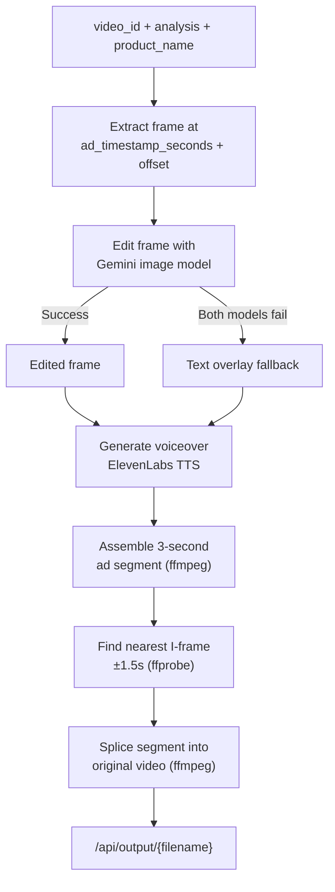

Video generation is the final step in the Splyce pipeline. It takes the cached video, the `ad_placement` analysis from step 2, and the `product_name` from step 1, then produces a merged video with the ad seamlessly inserted at the chosen timestamp.

The full pipeline is orchestrated by `generate_edited_video()` in `app/video_ad_integration.py`.

## Step 1: Frame extraction

Splyce uses ffmpeg to extract a single still frame from the original video. The extraction timestamp is calculated as:

```
extract_at = ad_timestamp_seconds + (AD_SEGMENT_DURATION × AD_FRAME_OFFSET_RATIO)
```

- `AD_SEGMENT_DURATION` defaults to `3` seconds
- `AD_FRAME_OFFSET_RATIO` defaults to `0.2` (20% into the ad window)

So for a placement at 12.5 seconds, the extracted frame comes from `12.5 + (3 × 0.2) = 13.1` seconds. This offset places the frame slightly after the cut point, giving a more representative frame for editing.

## Step 2: Frame editing

`generate_edited_frame()` sends the extracted frame to a Gemini image generation model along with:

- The `product_name`
- The `ad_description` from the placement analysis
- The `edit_instruction` specifying the exact body location

Gemini attempts to add the product physically onto the character in the frame — on the wrist for a watch, in the hand for a phone, worn or held for other items.

### Model fallback order

Splyce tries image models in this order:

1. `gemini-3.1-flash-image-preview`
2. `gemini-2.5-flash-image`
3. Text overlay fallback (`overlay_product_label_on_image`)

<Warning>
If both Gemini image models fail — due to quota, content policy, or model availability — Splyce falls back to rendering the product name as a text overlay on the original frame. The ad segment is still generated and spliced, but the visual edit will be a label rather than a composited product image.
</Warning>

### Product placement logic

The placement target is derived from `ad_description.visual`:

- Watches → placed on a wrist
- Phones → placed in a hand
- Other products → worn or held according to Gemini's interpretation of the scene

<Tip>
The accuracy of product placement depends heavily on the body part being clearly visible and unobstructed in the extracted frame. The video analysis step explicitly evaluates this — frames with partial occlusion or motion blur may produce lower-quality edits.
</Tip>

## Step 3: Voiceover generation

`generate_voiceover()` calls ElevenLabs TTS to synthesize the voiceover line from `ad_description.text_or_voiceover`.

**Default voiceover line:** `"Oh wow, a {product_name}."`

If `use_cloned_voice` is enabled (default), ElevenLabs uses Instant Voice Clone with a reference audio file. The default reference is `wolf_voice.mp4`, configurable via the `VOICE_REFERENCE_PATH` environment variable. The cloned voice matches the character's speaking style, making the voiceover blend with the surrounding dialogue.

<Note>
Voice cloning requires a valid ElevenLabs API key with access to the Instant Voice Clone feature. If cloning fails or `use_cloned_voice` is `false`, ElevenLabs falls back to a standard pre-built voice specified by `voice_id`.
</Note>

## Step 4: Ad segment assembly

`build_ad_segment()` uses ffmpeg to combine the edited frame and voiceover audio into a `3`-second video segment (`AD_SEGMENT_DURATION`). The frame is held as a still image for the full duration while the voiceover plays.

The segment is written to a temporary file and used directly in the splice step.

## Step 5: Video splicing

`splice_video()` inserts the 3-second ad segment into the original video at `ad_timestamp_seconds` using ffmpeg's `filter_complex concat` filter. The operation replaces exactly the 3-second window starting at the target timestamp — no frames from the original video are preserved within that window.

### Natural cut point detection

Before splicing, Splyce uses ffprobe to scan for the nearest **I-frame** (keyframe) within ±1.5 seconds of the target timestamp. Cutting at an I-frame avoids visual artifacts that occur when splitting at non-keyframe positions in H.264/H.265 streams.

If no I-frame is found within the ±1.5 second window, Splyce falls back to the exact `ad_timestamp_seconds` value.

## Output

The merged video is written to the server's output directory and served at:

```
GET /api/output/{filename}
```

The `/api/generate-ad-video` response includes the full URL to the merged video file.

<Tip>
Output files are not automatically cleaned up. If you are running Splyce in a long-lived environment, set up a periodic cleanup of the output directory to prevent disk space exhaustion.
</Tip>

## Full generation flow


